VSCode 在[ 1.102 版本內建跑 MCP Server 功能](https://code.visualstudio.com/updates/v1_102#_mcp-support-in-vs-code-is-generally-available){target="_blank"}，可以使用[ Marktplace 功能直接在 VSCode 內安裝＆跑 Markitdown MCP Server](https://github.com/mcp/microsoft/markitdown){target="_blank"}，給內建的 GithHub Copilot Chat AI 模型使用。

而由於[ Roo Code 也支援呼叫 MCP Server 功能](https://docs.roocode.com/features/mcp/overview){target="_blank"}，所以我們也可以在 Roo Code 內做好相關設定，讓 Roo Code 配套的 LLM AI 模型去呼叫 VSCode 的 Markitdown MCP Server，而不僅僅專屬於 GitHub Copilot Chat 獨佔使用。

## 安裝並啟動 VSCode 的 Markitdown MCP Server 

### 啟用 VSCode 內建的 MCP Server 功能並安裝 Markitdown MCP Server

雖然 VSCode 內建 MCP Server 功能，但由於資安考量，預設是沒有啟用直接從[ GitHub MCP Server Registry ](https://github.com/mcp){target="_blank"}安裝，所以我們需要先[在 VSCode 的設定中啟用](https://code.visualstudio.com/docs/copilot/customization/mcp-servers#_add-an-mcp-server-from-the-github-mcp-server-registry){target="_blank"}，或在擴充套件安裝側邊欄介面中啟用：

1. 在 VSCode 側邊欄選擇 Extensions (擴充套件) 圖示時，最下方的 **MCP SERVERS** 介面，展開預設是空的，並且沒有任何滑鼠/鍵盤選單可以操作: 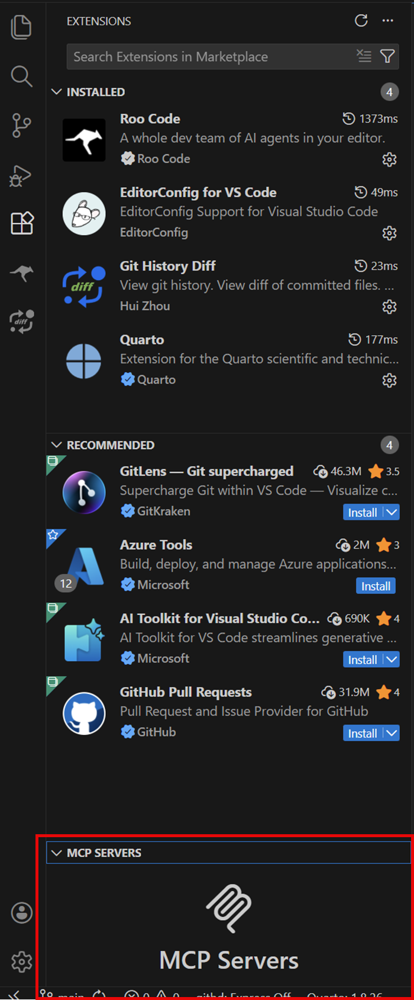
2. 在最上方的搜尋欄輸入 `@mcp` ，這時會出現詢問是否要啟用 MCP Server Marketplace 的UI提示，按下方的 "Enable MCP Marketplace" 按鈕: 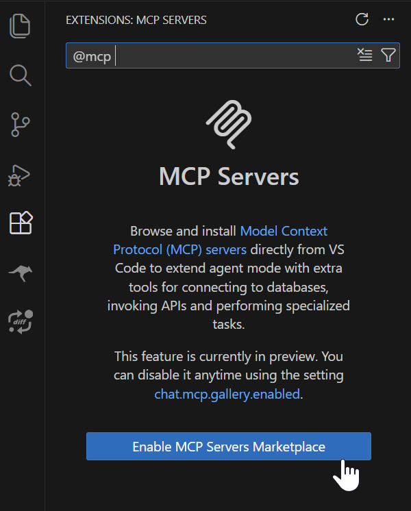 接著會跳出確認視窗，按下 "Enable" 按鈕: 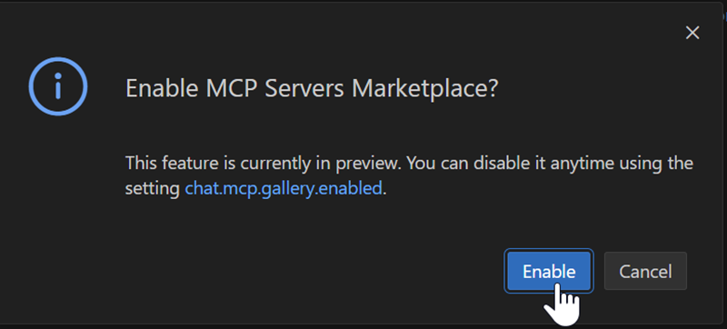
3. 啟用後，此時 VSCode 左側的擴充套件側邊欄UI會顯示各種可安裝的 MCP Server 清單，繼續在上方的搜尋欄輸入英文字 `markitdown` ，就會出現 Markitdown MCP Server 擴充套件，按下 "Install" 按鈕安裝: 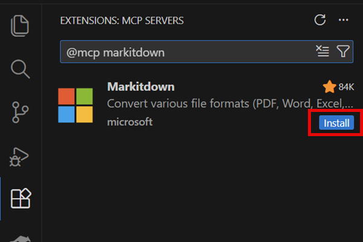
4. 安裝完畢後，會在 MCP SERVERS 介面看到 Markitdown MCP Server 已經安裝完成: 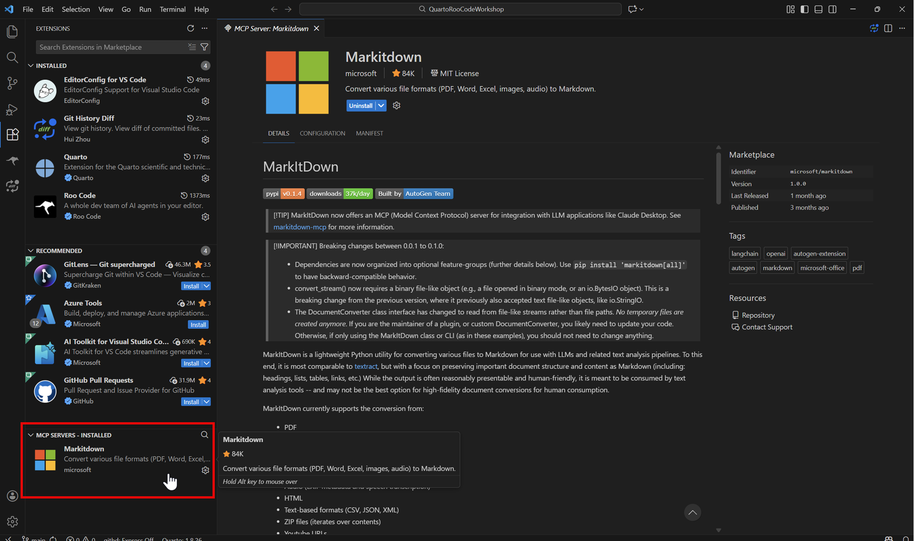

### 啟動 Markitdown MCP Server

1. 安裝 Markitdown MCP Server 完成後，在 MCP SERVERS 介面中，在 Markitdown 項目按滑鼠右鍵或是滑鼠左鍵點選右下角齒輪圖示開啟功能選單，選擇 "Start" 以啟動 Markitdown MCP Server: 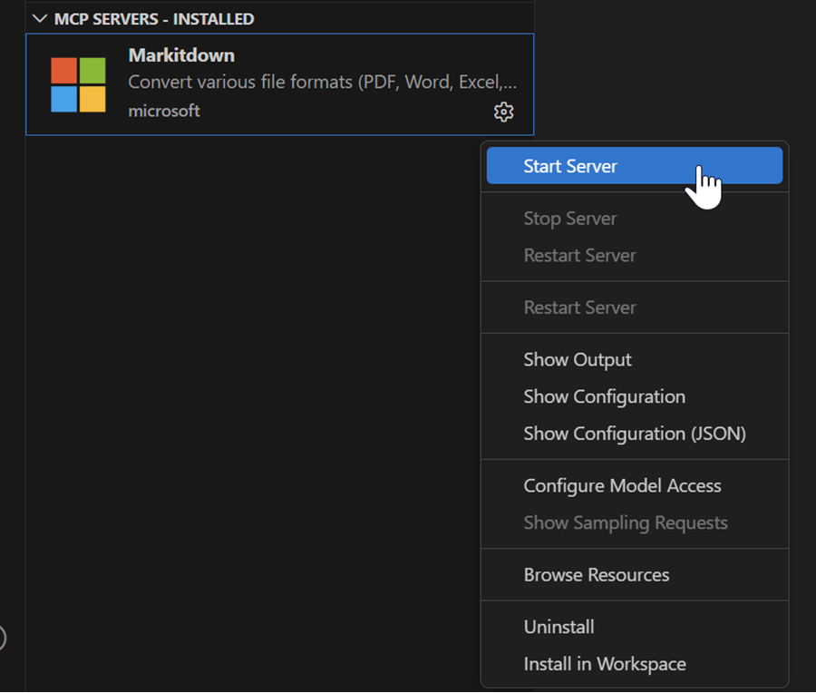
2. 注意，此時如果你的電腦環境沒有安裝[ uv ](https://docs.astral.sh/uv/){target="_blank"}這個 Python 新的套件管理程式的話，會跳出提示視窗詢問你是否要安裝 uv，按下右側的 "Install" 按鈕: 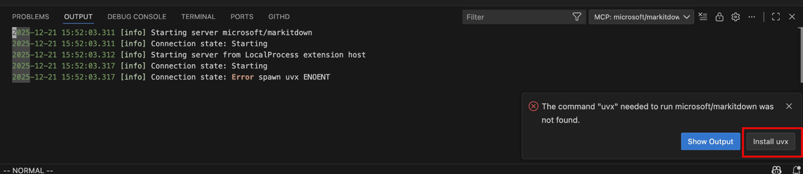 然後其實會根據你使用的作業系統，自動幫你安裝 uv ，或是跳出[ uv 官方的安裝說明頁面](https://docs.astral.sh/uv/getting-started/installation/){target="_blank"}，依照指示安裝 uv 即可。
3. 安裝完 uv 後，再次在 MCP SERVERS 介面中，在 Markitdown 項目按滑鼠右鍵或是滑鼠左鍵點選右下角齒輪圖示開啟功能選單，選擇 "Start" 以啟動 Markitdown MCP Server，這次在 VSCode 自動導引 uv 安裝 Markitdown 需要的套件之後應會成功啟動，並且在下方的 Output (輸出) 視窗中看到 Markitdown MCP Server 的 `[info]  Connection state: Running` 成功啟動log訊息： 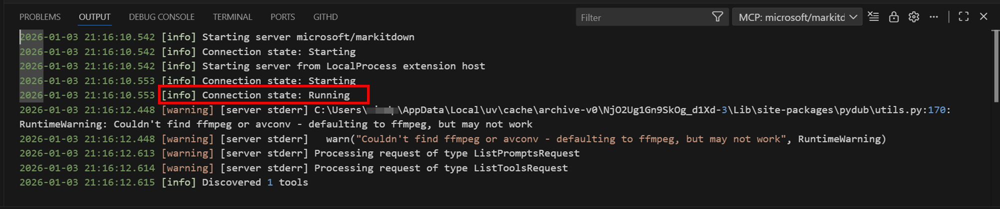 如果如圖所示有看到 ffmpeg 的相關訊息，如果沒有需要用到 Markitdown 的語音轉文字功能的話，基本上此時 MCP Server 已經是可以正常運作了，可以不必安裝 ffmpeg。

## 在 Roo Code 中設定使用 VSCode 的 Markitdown MCP Server

在 VSCode 成功啟動 Markitdown MCP Server 後，接著我們要在 Roo Code 中設定使用這個 MCP Server：

1. 在 Markitdown MCP Server 啟動成功後，在 VSCode 的 MCP SERVERS 介面中，按滑鼠右鍵或是滑鼠左鍵點選右下角齒輪圖示開啟功能選單，選擇 "Show Configuration (JSON)"： 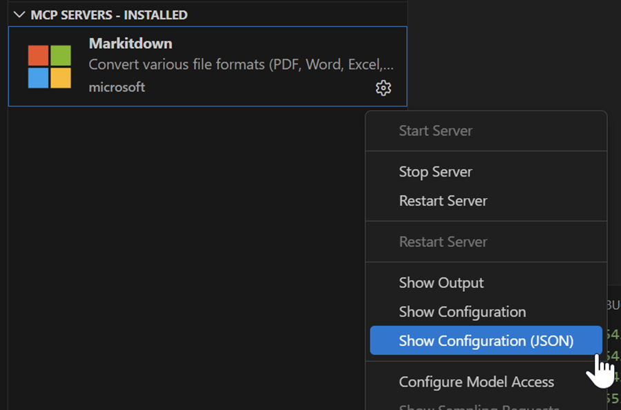 
2. 這時會打開一個新的 VSCode 編輯視窗，裡面是 Markitdown MCP Server 的設定檔內容，複製 `servers: {}` 區塊的內容: 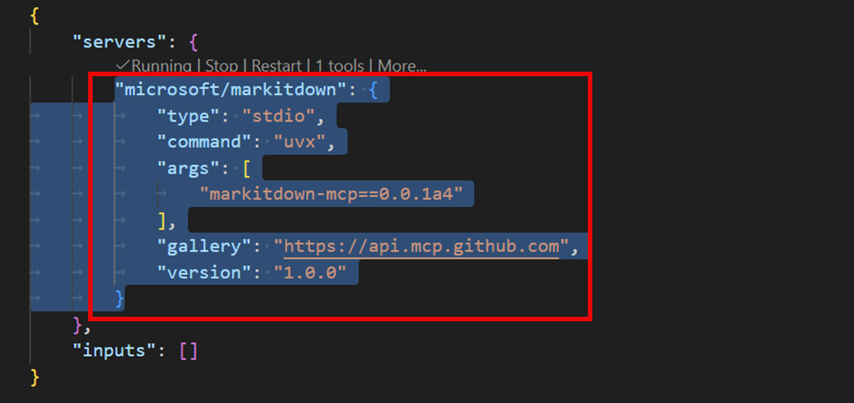
3. 接著打開 Roo Code 設定 MCP 的介面，選擇 "Edit Project MCP" 按鈕: 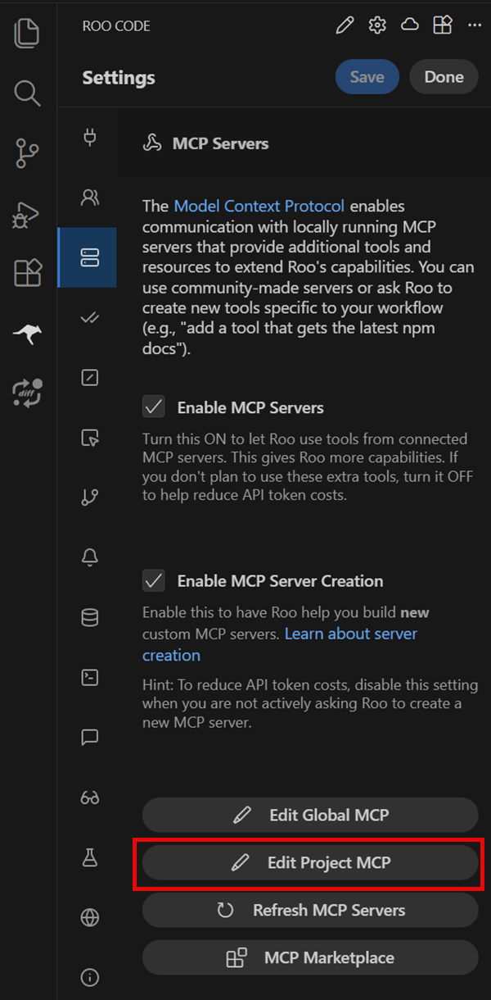
4. 此時會建立在專案目錄下 .roo 目錄內的 ***mcp.json*** 檔案，並且 VSCode 會自動開啟之，將剛剛複製的 Markitdown MCP Server 設定內容貼上: 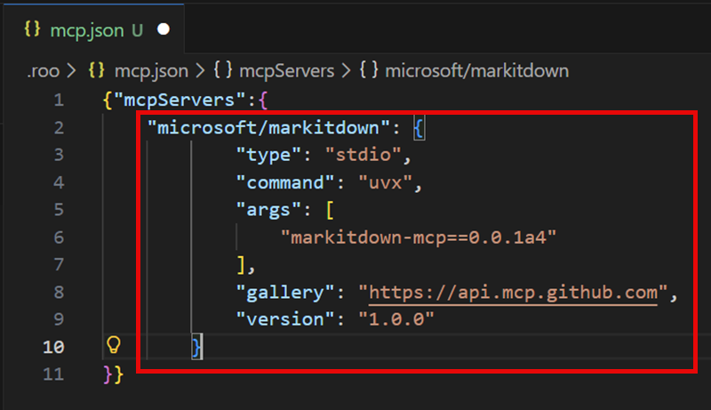 然後存檔關閉此檔案。

之後就可以在 Roo Code 中讓 Roo Code 配套的 LLM AI 模型去呼叫 VSCode 的 Markitdown MCP Server 了。

例如以下是使用 Roo Code 設定使用 Mistral AI 模型，並且透過 Markitdown MCP Server 去轉換一個 .docx 報價單檔案後，可成功展示報價單表格的範例： 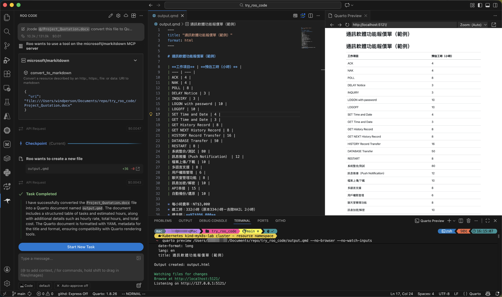